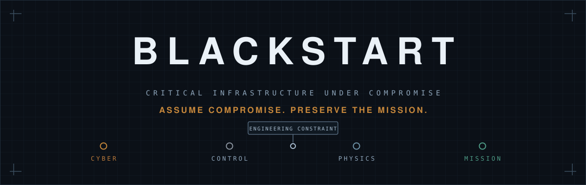
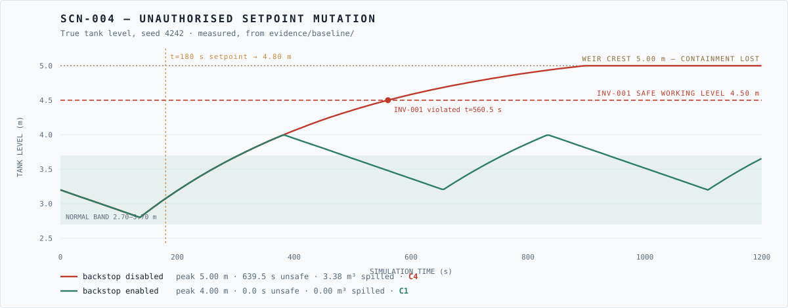
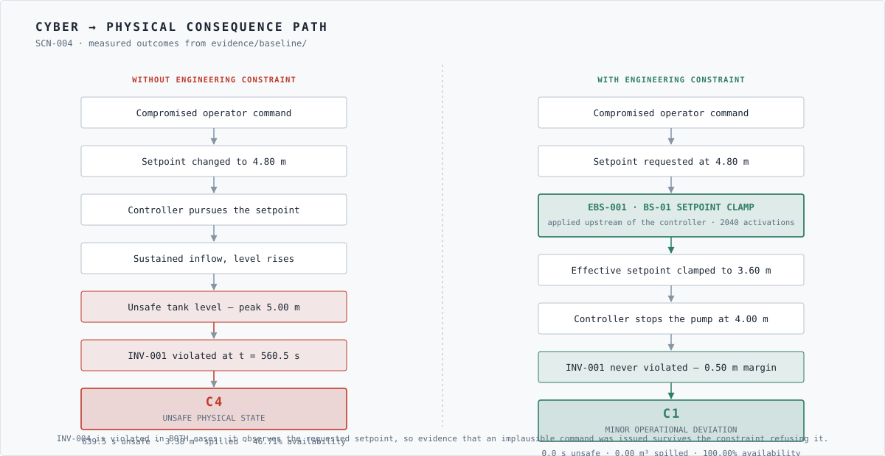
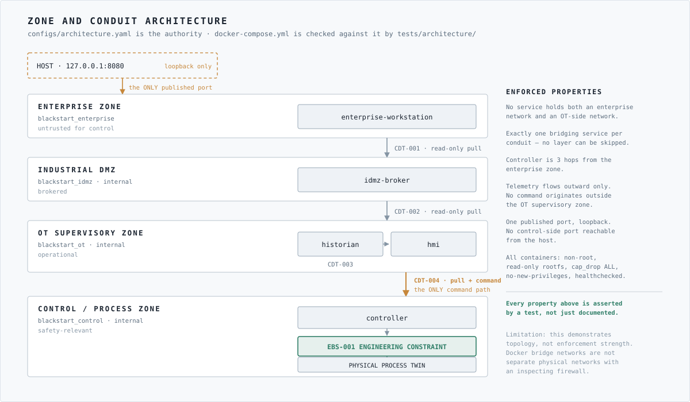
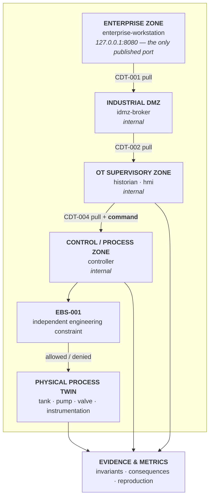

<div align="center">



<br>

**A consequence-driven cyber-physical resilience range for critical infrastructure under compromise.**

[](https://github.com/bbrookhart/blackstart-cyber-range/actions/workflows/ci.yml)
[](https://github.com/bbrookhart/blackstart-cyber-range/actions/workflows/security.yml)
[](pyproject.toml)
[](LICENSE)
[](CHANGELOG.md)

</div>

---

## The research question

Most industrial security work asks whether an attacker can get into an OT network.
BLACKSTART asks the question that matters after that one has been answered badly:

> **If digital compromise occurs, can the physical mission still be kept inside
> acceptable bounds?**

The premise is that perimeter security will sometimes fail, and that the useful
engineering question is what stands between a compromised digital environment and
an unacceptable physical consequence. BLACKSTART reasons across the whole chain:

```text
cyber event → digital capability → system dependency → control state
  → physical state → mission consequence → engineering response
    → mission preserved, or not
```

It models a fictional municipal water storage and pumping process as a
deterministic digital twin, evaluates explicit safety invariants against
ground-truth physical state, derives consequence severity from measurable
conditions, and measures whether a simulated **independent engineering
constraint** changes the outcome.

> [!IMPORTANT]
> BLACKSTART contains no exploitation tooling and cannot act on any system
> outside its own process — a property enforced structurally and verified by
> tests, not promised in a policy. See [ADR-006](docs/adr/ADR-006-scenario-safety-boundary.md)
> and [SECURITY.md](SECURITY.md).
>
> Every parameter is **invented**. A BLACKSTART result describes BLACKSTART.
> Read [docs/limitations.md](docs/limitations.md) before drawing conclusions.

---

## Project status

**v0.1.0 — first operational research release.** All figures below are measured
output from [`evidence/baseline/`](evidence/baseline/), reproduced byte-for-byte
in CI on every change.

| Capability | Status |
| --- | --- |
| Deterministic physical twin | ✅ Operational |
| Safety invariants (5) | ✅ Operational |
| Consequence taxonomy (C0–C5) | ✅ Operational |
| Scenario engine (6 scenarios) | ✅ Operational |
| Engineering backstop (5 rules) | ✅ Operational |
| Structured evidence + byte-level reproduction | ✅ Operational |
| Consequence dependency graph | ✅ Operational |
| Zoned container topology | ✅ Operational — architecture tests pass; started and probed in CI |
| Network telemetry | ⚪ Not implemented |
| Detection / IDS integration | ⚪ Not implemented — detection metrics report `NOT_IMPLEMENTED` |
| Valve command-path constraint | ⚪ Known gap, [recorded](threat-model/consequence-paths.yaml) |
| Formal verification | 🟡 [Roadmap](docs/formal-assurance-roadmap.md) — not claimed |
| Evidence signing | 🟡 Roadmap — integrity is tamper-*evident* only |
| Hardware-in-the-loop | ⚪ Research direction |

**377 tests** · **95% branch coverage** on safety-critical modules (90% gate) ·
strict `mypy` across 74 files.

---

## Flagship result

**SCN-004 — unauthorised setpoint mutation.** The supervisory level setpoint is
changed to 4.80 m, above the 4.50 m safe working level, by something other than
legitimate operator action. Every digital component then behaves exactly as
designed: the controller faithfully pursues the setpoint it was given, and the
instrumentation reports honestly. Nothing malfunctions.

The same scenario, the same seed, the same configuration — differing in exactly
one respect.

<div align="center">

</div>

| Metric | Backstop **disabled** | Backstop **enabled** |
| --- | --- | --- |
| Maximum consequence | **C4** — unsafe physical state | **C1** — minor deviation |
| Invariant violations | 2 | 1 |
| Violated invariants | INV-001, INV-004 | INV-004 |
| Service availability | 46.71% | **100.00%** |
| Unsafe-state duration | **639.5 s** (53.3% of run) | **0.0 s** |
| Maximum tank level | **5.000 m** (weir crest) | 3.9998 m |
| Spill volume | **3.382 m³** | 0.000 m³ |
| INV-001 first violated | t = 560.5 s | never |

`EXP-SCN004-backstop-disabled-a6e4affc` · `EXP-SCN004-backstop-enabled-457bc4c1`

<details>
<summary><b>Three things about this result that are easy to misread</b></summary>

<br>

**The setpoint clamp did the work; the high-level trip never fired.**
BS-01 acted on 2040 scans, BS-02 on 16, and **BS-03 zero times**. The constraint
worked by ensuring the controller never pursued an unsafe target, not by catching
the result at the last moment. Two layers existed; only the outer one was needed.

An earlier revision of this project applied the clamp *downstream* of the control
request. The controller then chased 4.80 m and was stopped only by the trip,
peaking at 4.19 m against a 4.20 m trip level. The scenario "passed" either way —
which is exactly why per-rule activation counts are reported.

**Service availability fell without any loss of service.** Demand was met
throughout both runs. The critical function CF-001 requires *both* delivered
service *and* no violated safety invariant; a process delivering water perfectly
while sitting above its safe level is not performing its critical function.

**The anomalous command was detectable in both variants.** INV-004 observes the
*requested* setpoint rather than the constrained one, so evidence that a
physically implausible command was issued survives the constraint refusing it.
That is a detection opportunity that does not depend on the defence having failed
— though nothing in v0.1 consumes it.

</details>

---

## How the constraint breaks the chain

<div align="center">

</div>

The constraint's defining property is that **it does not try to decide whether a
command is legitimate**. The controller service accepts a setpoint write, records
the declared origin, and applies exactly the same policy regardless of what the
writer claimed to be. A defence that depended on correct attribution would fail
precisely when attribution failed — which is the situation after compromise.

---

## Architecture

<div align="center">

</div>



Four zones, four isolated Docker networks, **one bridging service per conduit**.
No service holds both an enterprise network and an OT-side network; reaching the
controller from the enterprise zone requires three hops through three services.
Telemetry flows outward; CDT-004 is the only conduit carrying commands.

`configs/architecture.yaml` is the authority, and
[`tests/architecture/`](tests/architecture/) parses `docker-compose.yml` and fails
if the two disagree. A segmentation claim nobody checks decays into one that is
false.

---

## Consequence-driven methodology

BLACKSTART does not start from *what CVEs exist?* It starts from *what physical
outcomes must never occur?*

```text
1. critical function        CF-001: keep water available and the process safe
2. unacceptable outcomes    C0..C5, with quantitative thresholds
3. enabling systems         tank, pump, valve, controller, instrumentation
4. digital dependencies     what can influence each of the above
5. credible paths           enumerated from the dependency graph
6. detection opportunities  where a condition becomes observable
7. engineering mitigations  constraints that break a path
8. recovery                 what returns the mission to acceptable bounds
```

A vulnerability-first analysis produces a list that grows without bound and never
says which items matter. This ordering produces a short list of things that can
actually reach the physical process, and a defensible reason for each. It is
*informed by* publicly described consequence-driven engineering principles;
BLACKSTART is **not** an implementation of CCE and implies no endorsement.

Full method: [docs/methodology.md](docs/methodology.md).

---

## Quick start

```bash
git clone https://github.com/bbrookhart/blackstart-cyber-range
cd blackstart-cyber-range

make bootstrap          # create the venv, install everything
make test               # 377 tests
make demo               # reproduce the flagship comparison
```

Reproduce the flagship result and verify it independently:

```bash
uv run blackstart experiment compare SCN-004 \
    --variant backstop-disabled --variant backstop-enabled

uv run blackstart evidence verify --all --reproduce --evidence-root evidence/baseline
```

The second command re-executes each committed experiment from its recorded
configuration and seed and compares every artefact **byte-for-byte**.

<details>
<summary><b>Command surface</b></summary>

<br>

```bash
blackstart scenario list                     # the scenario catalogue
blackstart scenario show SCN-004             # one scenario in full
blackstart experiment run SCN-001            # run one scenario
blackstart experiment compare SCN-004        # run and compare variants
blackstart evidence verify --all --reproduce # integrity + re-execution
blackstart graph supports --critical-function CF-001
blackstart graph influences INV-001
blackstart graph paths --min-class C4
blackstart graph reduction
blackstart config validate
```

```bash
make bootstrap lint typecheck test coverage audit sbom docs
make up health demo down          # zoned container topology (needs Docker)
make check                        # the full local gate
```

</details>

---

## Safety invariants

Invariants are the ground-truth record of whether the process was actually safe.
They evaluate true physical state, not what the control system believed — with
one deliberate exception.

| ID | Property | Limit | Tolerance | Maps to |
| --- | --- | --- | --- | --- |
| **INV-001** | Tank level ≤ safe working level | 4.50 m | none | C4 |
| **INV-002** | Level ≥ operational reserve | 1.00 m | 120 s | C3 |
| **INV-003** | Pump not energised without suction | 0.50 m source | 10 s | C4 |
| **INV-004** | Command rate physically achievable | 0.05 m/s · 12 starts/h | none | C1 |
| **INV-005** | Reported level tracks true level | 0.10 m | 5 s | C1 |

Three design decisions carry most of the weight:

- **Stateful temporal predicates, not assertions.** "Below reserve" is not a
  violation; "below reserve for longer than 120 s" is.
- **Three-valued status** (`OK` / `APPROACHING` / `VIOLATED`), so the *warning* an
  engineered control bought is measurable, not just the breach.
- **INV-005 is the only invariant reading both views**, because comparing them is
  its purpose. This is why a scenario that deceives the operator cannot also
  falsify the experimental record.

The invariant checker **shares no code with the engineering backstop** — verified
by AST analysis. Without that separation, "backstop enabled ⇒ no violations"
would be a tautology rather than a measurement.
[ADR-004](docs/adr/ADR-004-safety-invariant-design.md).

---

## Scenario catalogue

| ID | Name | Category | Backstop off → on | Notes |
| --- | --- | --- | --- | --- |
| **SCN-001** | Nominal operation | baseline | C0 → C0 | The clean baseline every result is read against |
| **SCN-002** | Demand surge | physical | C2 → C2 | Benign disturbance, **zero** invariant violations |
| **SCN-003** | Sensor integrity loss | cyber-effect | **C4 → C1** | INV-005 violated in *both* |
| **SCN-004** | Unauthorised setpoint mutation | cyber-effect | **C4 → C1** | Flagship |
| **SCN-005** | Loss of supervisory visibility | operational | C0 → C0 | Loss of view ≠ loss of control |
| **SCN-006** | Source depletion / dry-run | physical | **C5 → C3** | The interlock relocates a consequence |

<details>
<summary><b>The results that complicate the argument — and are kept anyway</b></summary>

<br>

**SCN-002 — not every bad outcome is a security event.** A large benign demand
surge produces a genuine C2 service consequence with **zero** invariant
violations and no adversary. A range that flagged this as a security event would
be producing false positives; one that called it harmless would be ignoring a
real loss of service. The classifier reaches the right answer without being told,
and the backstop correctly makes no difference at all.

**SCN-003 — the constraint preserves the process, not the operator.** A falsified
level transmitter drives the tank to the weir crest without the constraint. With
it, the independent high-level trip (BS-03, and *not* BS-01 here) holds the level
safe. But **INV-005 is violated in both variants**: the engineering control
defends the physical mission and does nothing whatsoever for situational
awareness.

**SCN-006 — an engineered control can relocate a consequence rather than remove
it.** The dry-run interlock prevents the pump being destroyed (C5 → C3). It does
not prevent the loss of service, because the underlying problem is that there is
no supply, and no control on the command path can create water.

**The architectural reduction is modest.** Of 40 enumerated dependency paths
reaching C4 or above, the backstop interrupts 18 — **45%**. Every
`CTRL-RESERVE → VLV-001` path is uninterrupted: the constraint covers the pump
command path and applies nothing to the valve. That is a real gap in the current
design, surfaced by querying the model rather than by inspection, and held
visible by a test.

A result set in which the defence improved every number would be evidence of a
rigged model, not a good defence.

</details>

---

## Evidence model

Every experiment writes a self-describing directory:

```text
EXP-SCN004-backstop-enabled-457bc4c1/
├── manifest.json       provenance, seed, config hash, per-artefact SHA-256
├── configuration.json  the fully resolved configuration actually executed
├── events.jsonl        ordered structured event stream
├── process.csv         per-timestep true AND reported physical state
├── invariants.json     per-invariant outcome, intervals, peak excursion
├── consequences.json   consequence timeline and maximum severity
├── metrics.json        computed research metrics
└── summary.md          human-readable account, with its own limitations
```

An experiment is a pure function of `(version, configuration, seed)`, and the
**experiment identifier is derived from that triple** — so re-running reproduces
the package byte-for-byte, identifier included.

> [!NOTE]
> Evidence integrity is **tamper-evident, not tamper-proof**. Digests catch
> corruption, partial writes and stale files. Anyone who can edit the artefacts
> can recompute the manifest. Signing is a roadmap item; claiming more today would
> be an overstatement. [ADR-005](docs/adr/ADR-005-evidence-and-reproducibility.md)

Metrics whose underlying capability does not exist report the literal string
`NOT_IMPLEMENTED`. BLACKSTART v0.1 has no detection capability, so detection
latency, containment latency and false-positive rate all carry that marker rather
than a plausible-looking zero.

---

## Threat model

Consequence-first: it starts from the outcomes that must never occur and reasons
backward to the digital dependencies that could produce them.

- [Assumptions](threat-model/assumptions.md) — each marked with what happens to
  the conclusions **if it is wrong**
- [Trust boundaries](threat-model/trust-boundaries.md) — five, each enforced by
  something checkable
- [Consequence paths](threat-model/consequence-paths.yaml) — all 40, **generated**
  from the dependency graph and kept in sync by a test
- [ATT&CK for ICS coverage](threat-model/attack-ics-mapping.yaml) — including the
  objectives BLACKSTART does *not* model

The adversary is assumed able to obtain influence over selected digital
components. **BLACKSTART does not model how.** It therefore offers no evidence
about whether such influence is achievable against any real system — deliberate
scoping, and a real limitation.

---

## Standards and framework traceability

All mappings are **informational**. No conformance, compliance, certification or
endorsement is claimed or implied.

| Framework | Document | Coverage |
| --- | --- | --- |
| MITRE ATT&CK for ICS | [attack-ics.yaml](framework-mappings/attack-ics.yaml) | 4 techniques, 2 tactics; none of the intrusion lifecycle |
| NIST SP 800-82r3 | [nist-800-82.md](framework-mappings/nist-800-82.md) | Architecture and OT-priority principles |
| NIST CSF 2.0 | [nist-csf-2.0.yaml](framework-mappings/nist-csf-2.0.yaml) | Function level only — see below |
| CISA Cross-Sector CPGs | [cisa-cpg.md](framework-mappings/cisa-cpg.md) | ~5 goal areas; mostly non-applicable |
| IEC 62443 | [iec-62443-concepts.md](framework-mappings/iec-62443-concepts.md) | Public concepts; no Security Level claimed |

Two things worth noting about how these were produced:

**Identifiers are verified before use.** ATT&CK techniques were requested directly
from `attack.mitre.org`; three identifiers considered during design turned out to
have been **renumbered upstream** (T0855 → T1692.001, T0856 → T1692.002,
T0804 → T1691.002) and are recorded as such rather than used in obsolete form.

**CSF 2.0 is mapped at Function level only** because Category and Subcategory
identifiers could not be verified against the authoritative publication. Mapping
coarsely was preferred to asserting identifiers reproduced from memory — which is
precisely the failure this project argues against.

The mapping file also records **rejected** mappings with reasons. T0880 *Loss of
Safety* was declined for scenarios producing an unsafe process state, because that
technique concerns loss of safety *systems* — and here the safety instrumentation
stays intact and reports correctly throughout.

---

## Repository map

```text
blackstart/            the deterministic simulation kernel
├── core/              physics · invariants · consequence · dependency graph
│                      (sealed: no network, no subprocess, no wall clock)
├── controller/        control logic · PLC scan · engineering backstop
├── scenario_engine/   schema · closed effect registry · runner
├── telemetry/         event envelope and exporters
├── evidence/          packaging · integrity · byte-level reproduction
├── analysis/          metrics and variant comparison
└── cli/               the reviewer-facing surface

services/              zoned demonstration topology (produces no results)
configs/               process · invariants · consequences · architecture · assets
scenarios/             SCN-001 … SCN-006, with measured expectations
evidence/baseline/     committed reference results, reproduced in CI
experiments/baseline/  the flagship experiment write-up
threat-model/          assumptions · trust boundaries · consequence paths
framework-mappings/    ATT&CK · NIST · CISA · IEC, with verification dates
docs/                  methodology · limitations · reviewer guide · ADRs 001–006
tests/                 unit · property · integration · architecture
```

---

## Reviewer path

A ten-minute route with exact commands is in
**[docs/reviewer-guide.md](docs/reviewer-guide.md)**, including a section on
*what to attack if you want to find weaknesses*.

The five commands:

```bash
make bootstrap
make test
make demo
uv run blackstart evidence verify --all --reproduce --evidence-root evidence/baseline
uv run blackstart graph paths --min-class C4
```

---

## Roadmap

The highest-value next milestone is **network telemetry and passive detection**
([M9](docs/roadmap.md)). It is the reason every detection metric currently reads
`NOT_IMPLEMENTED`, and it would unlock the measurement that matters most: the
false-positive rate against the SCN-002 benign disturbance.

Also planned: constraining the valve command path, OT protocol emulation, evidence
signing, formal verification of the backstop policy, and statistical experimental
design. Full list with rationale: [docs/roadmap.md](docs/roadmap.md).

---

## Limitations

> [!WARNING]
> **A BLACKSTART result describes BLACKSTART.** It is a simulation of a fictional
> process whose every parameter was invented. It is not evidence about how any
> real water utility, control system, or piece of equipment would behave.

In brief — the full statement is [docs/limitations.md](docs/limitations.md):

- **No detection capability whatsoever.** No analytic, no rule, no network
  telemetry.
- **Effects, not mechanisms.** The scenarios begin from assumed compromise and say
  nothing about whether it is achievable.
- **The backstop's independent measurement channel is an assumption.** A real
  independent element can itself be compromised.
- **The valve command path is unconstrained.** A known, recorded gap.
- **Segmentation demonstrates topology, not enforcement strength.**
- **No statistical power.** One seed per run; the flagship finding is checked
  across four. No confidence intervals, no significance claims.
- **Tested, not proven.** No formal verification has been performed.
- **Not a safety case.** No hazard analysis, no SIL, no Security Level, no
  certification.

---

## Responsible use

BLACKSTART is a **defensive research simulation**, published so that engineers and
researchers can reason rigorously about consequence-driven engineering.

It must never be connected to a real control system, exposed beyond the host, or
loaded with real utility credentials, configurations or operational data. It
contains no malware, no exploits, no credential tooling and no scanning
capability, and contributions that would add them are refused.

See [SECURITY.md](SECURITY.md), [CONTRIBUTING.md](CONTRIBUTING.md) and
[docs/research-integrity.md](docs/research-integrity.md).

**No affiliation with or endorsement by** Idaho National Laboratory, NIST, CISA,
MITRE, Sandia National Laboratories, IEC, ISA, any government or agency, or any
utility or vendor is claimed or implied.

---

## Citation

```bibtex
@software{blackstart_2026,
  title  = {BLACKSTART: A Consequence-Driven Cyber-Physical Resilience Range
            for Critical Infrastructure Under Compromise},
  author = {Brookhart, Brian},
  year   = {2026},
  version = {0.1.0},
  license = {Apache-2.0},
  url    = {https://github.com/bbrookhart/blackstart-cyber-range}
}
```

Machine-readable metadata: [CITATION.cff](CITATION.cff). No affiliation or ORCID
is recorded; both are omitted rather than guessed.

---

## License

[Apache License 2.0](LICENSE). All visual assets in [`assets/`](assets/) are
original work committed to this repository; the experiment chart is rendered from
measured evidence by [`scripts/render_experiment_preview.py`](scripts/render_experiment_preview.py).

<div align="center">
<br>
<sub><b>Assume compromise. Preserve the mission.</b></sub>
</div>
