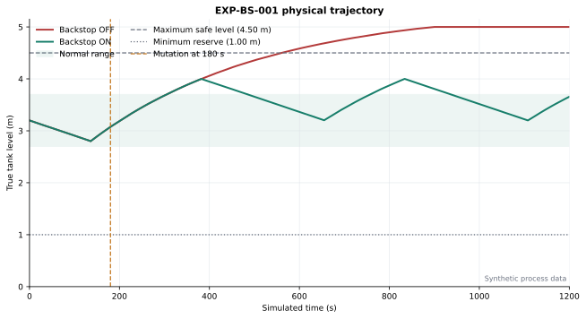
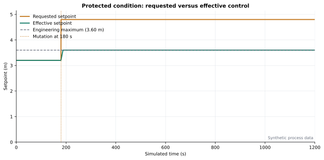
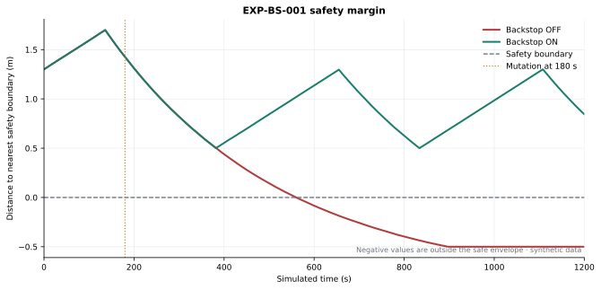

# BLACKSTART: Experimental Evaluation of an Engineering Backstop Under Simulated Supervisory Control Compromise

## Abstract

BLACKSTART evaluated whether an independently enforced engineering backstop can
prevent a simulated unauthorized supervisory setpoint mutation from producing an
unacceptable physical consequence in a deterministic synthetic water-storage
process. The unprotected condition reached **C4**,
remained outside the physical safety envelope for
**639.5 s**, and reached
**5.0000 m**. Under identical initial state,
demand, seed, timestep, and attack event, the protected condition reached
**C1**, recorded
**0.0 s** unsafe, and peaked at
**3.9998 m**. This is a result about the documented
synthetic model—not a claim of protection for an operational water system.

## Research Question

> If an adversary is assumed capable of modifying a critical control parameter
> after penetrating portions of the digital environment, can an independently
> enforced engineering backstop prevent that digital compromise from producing
> an unacceptable physical consequence?

## Hypothesis

**H1:** An independently enforced cyber-physical backstop will significantly
reduce or eliminate unacceptable physical consequences caused by an unauthorized
control-state mutation.

**H0:** The backstop produces no meaningful difference in physical consequence
under the defined experiment.

## Background

The experiment applies consequence-driven, cyber-informed engineering logic:
assume the supervisory command path can be compromised, preserve the critical
physical mission through an independently enforced engineering constraint, and
measure the complete cyber-to-consequence chain.

## Threat Model

At **t = 180.0 s**, a controlled internal event
sets the requested tank-level target to
**4.80 m**. No exploit chain,
credential theft, malware delivery, network penetration, or PLC exploitation is
implemented. The supervisory requested state is untrusted. The physics engine,
experiment orchestrator, backstop policy, and evidence verifier are trusted.

## Process Model

The fictional process contains one source, inlet pump, constant-area storage
tank, and gravity outlet. Explicit Euler integration uses a **0.5 s**
timestep. All values are synthetic; equations, units, saturation, and numerical
assumptions are documented in `docs/physical-model.md`.

## Engineering Backstop

EBS-001 sits between the requested supervisory state and the effective control
value. BS-01 clamps the effective setpoint to the configured engineering
envelope before the level controller acts. BS-02 bounds setpoint slew. Separate
permissives provide high-level trip, suction protection, and anti-cycling. The
scenario can mutate the supervisory request but cannot mutate the backstop policy.

## Safety Invariants

INV-001 bounds maximum level; INV-002 maintains minimum reserve; INV-003 protects
against dry run; INV-004 records an implausible requested command rate; INV-005
bounds the effective setpoint; INV-006 detects truth/reported-state divergence.
Every evaluation is preserved in `invariants.json`.

## Experiment Design

- Experiment: **EXP-BS-001-v1**
- Scenario: **SCN-004 — Unauthorized Setpoint Mutation**
- Seed: **4242**
- Duration: **1200.0 s**
- Condition A: backstop OFF
- Condition B: backstop ON
- Controlled variable: backstop state only
- Source fingerprint: `ff16c22261824171ebcf4aa267dc9d0d96026f931a51ea761049cd32dad0c963`

## Metrics

Metrics are derived from the process trace. Four release-critical metrics are
recalculated by a second implementation that reads only `process.csv`; the
comparison is recorded in `verification.json`.

## Results

| Metric | Backstop OFF | Backstop ON | Difference |
| --- | ---: | ---: | --- |
| Maximum tank level | 5.0 m | 3.9998 m | 1.0002 reduction |
| Unsafe duration | 639.5 s | 0.0 s | 639.5000 reduction |
| Invariant violation intervals | 3 | 1 | 2.0000 reduction |
| Invariant violation duration | 1660.0 s | 0.5 s | 1659.5000 reduction |
| Maximum consequence | C4 | C1 | C4 → C1 |
| Mission service availability | 46.7083 % | 100.0 % | +53.2917 improvement |
| Recovery time | NOT_RECOVERED | NOT_RECOVERED | no change |

Unsafe-state duration fell by **639.5 s**
(**100.0% consequence containment** for this
physical metric). The requested 4.80 m mutation remains present in both traces;
the protected result comes from constraining its physical influence, not deleting
the adversary event.

## Figures







## Analysis

The observed deterministic result is inconsistent with H0 for the documented
synthetic configuration: the protected and unprotected physical trajectories
differ materially while all inputs except backstop state remain identical. No
statistical significance claim is made. The evidence supports the narrow
claim that EBS-001 prevented the tested supervisory mutation from producing the
physical consequence observed without it.

## Threats to Validity

**Construct validity.** The model represents storage, pump inflow, gravity
outflow, demand, saturation, and control behavior, but it is not a calibrated
model of a real facility.

**Internal validity.** The two conditions share scenario, seed, initial state,
demand sequence, timestep, and code fingerprint. Only backstop state differs.

**External validity.** Generalization to operational OT systems is **not yet
established**. The independent backstop and sensor separation are modeled
assumptions, not field-validated properties.

**Reproducibility.** Evidence hashes, deterministic replay, independent metric
calculation, and the one-command reproduction script test whether another
researcher can obtain equivalent trajectories.

## Limitations

- simplified physical process and synthetic telemetry;
- fictional utility and no production infrastructure;
- no real PLC, hardware-in-the-loop, or utility network;
- no real adversary or exploit chain;
- assumed supervisory compromise;
- backstop outside the modeled compromise;
- one flagship compromise scenario;
- no claim of certification, compliance, or operational safety.

## Reproducibility

```bash
make bootstrap
make test
make experiment
```

The individual evidence packages are `EXP-SCN004-backstop-disabled-d14f929b` and
`EXP-SCN004-backstop-enabled-41fa58ff`. Run `blackstart evidence verify` and
`blackstart experiment verify-results` against each directory.

## Future Work

The next experiment should test sensor-state manipulation against the same
frozen process and backstop, without broadening sectors or adding hardware until
the new causal claim is equally reproducible.
